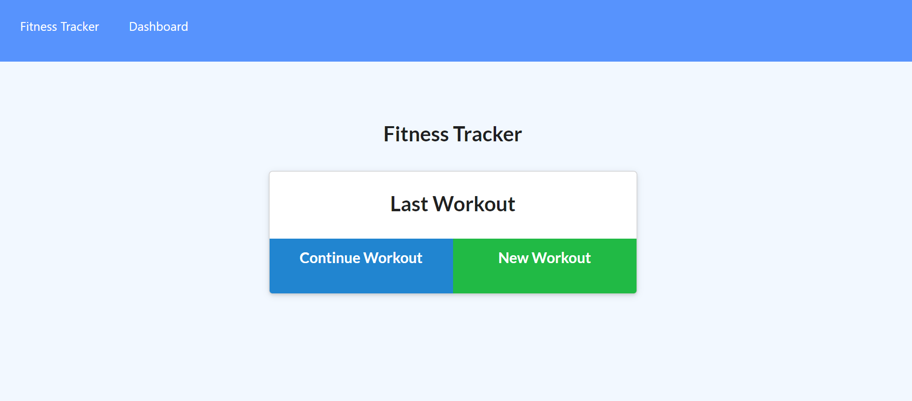

# workout-tracker

The task is to develop a create a workout tracker using a Mongo database.

## Description

The workout tracker is used to track daily workout products. 

## Technologies Used

* `Node.js`
* `npm (Node Package Manager)`
* `Javascript`
* `MongoDB Atlas`
* `Express.js`
* `Mongoose`

## User Story

```md
As a user, I want to be able to view create and track daily workouts. I want to be able to log multiple exercises in a workout on a given day. I should also be able to track the name, type, weight, sets, reps, and duration of exercise. If the exercise is a cardio exercise, I should be able to track my distance traveled.

```

## Acceptance Criteria

```md

  * Add exercises to the most recent workout plan.
  * Add new exercises to a new workout plan.
  * View the combined weight of multiple exercises from the past seven workouts on the `stats` page.
  * View the total duration of each workout from the past seven workouts on the `stats` page.
```

## Application Screenshots




## Application Links
* [Github](https://github.com/AlCharl88/workout-tracker)
* [Heroku Live Deployment](https://git.heroku.com/young-reaches-03760.git)

## Contact 

Alain Tagne - [Github](https://github.com/AlCharl88) Email: [Alain](mailto:alctagne@gmail.com) 

---

&copy; 2021 Alain Tagne